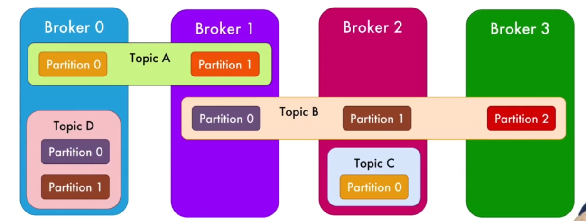
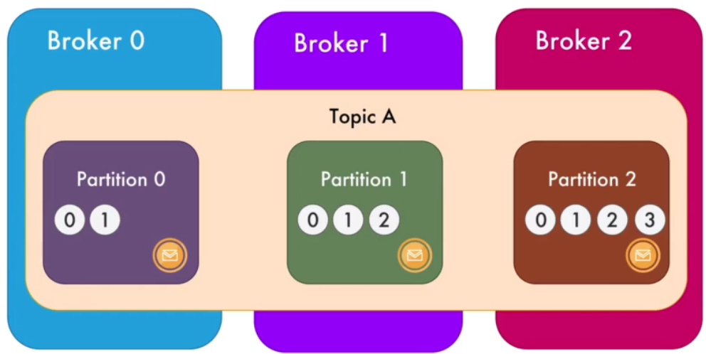
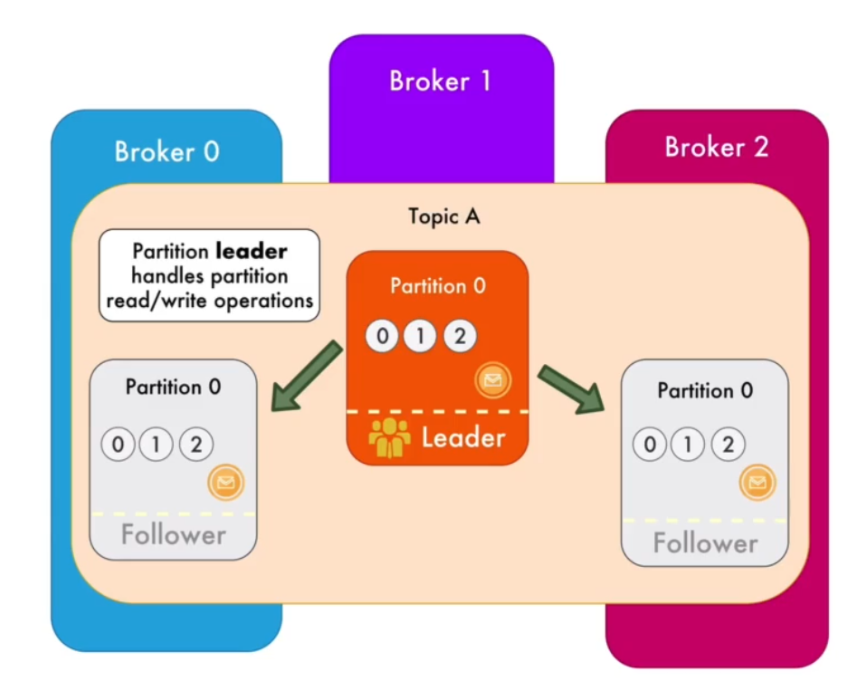
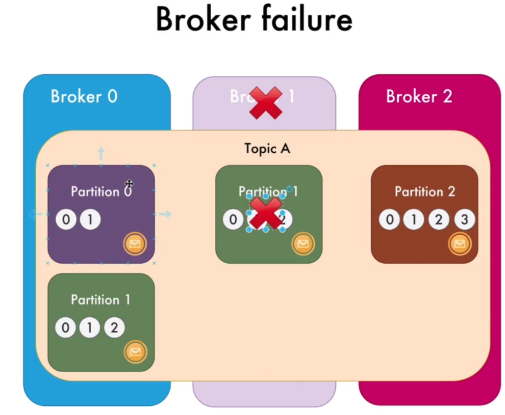

# Kafka

Share very small messages quickly

## Setup

1. download kafka .tgz @ https://kafka.apache.org/downloads
   - `curl https://downloads.apache.org/kafka/3.6.1/kafka-3.6.1-src.tgz -o kafka-3.6.1-src.tgz`
1. `mkdir kafka; cd kafka`
1. `tar -xvzf ../kafka-3.6.1-src.tgz --strip 1`
1. install Java
   - `brew install openjdk@11`
   - `export JAVA_HOME=/home/linuxbrew/.linuxbrew/opt/openjdk@11`
   - java -version
1. build dependency
   - `./gradlew jar -PscalaVersion=2.13.11`

## Kickstart

1. Zookeeper: `bin/zookeeper-server-start.sh config/zookeeper.properties`
   - 0.0.0.0:2181 (clientPort)
   - maintain state of brokers, manage config of topics and parttions, elect controller (master) among brokers (slaves)
1. Kafka server (BROKER): `bin/kafka-server-start.sh config/server.properties`
   - 0.0.0.0:9092 (listeners)
1. Create topic
   - `bin/kafka-topics.sh --bootstrap-server localhost:9092[,localhost:9093...] --create --replication-factor 1 --partitions 3 --topic <your-topic>`
   - see result at `logs/server.log`
   - see content at `/tmp/kafka-logs/<your-topic>-<num.partition>`
   - total partitions = partitions x replication-factor; usually replication-factor = 3
1. List topics
   - `bin/kafka-topics.sh --bootstrap-server localhost:9092 --list`
   - [DEPRECATED] `bin/kafka-topics.sh --list --zookeeper localhost:2181`
1. Describe topic:
   - `bin/kafka-topics.sh --bootstrap-server localhost:9092 --describe --topic <your-topic>`
1. Produce Message (PRODUCER)
   - `bin/kafka-console-producer.sh --broker-list localhost:9092[,localhost:9093...]  --topic cities`
1. Consume Message (CONSUMER)

   - `bin/kafka-console-consumer.sh --bootstrap-server localhost:9092[,localhost:9093...]  --topic cities` (New messages only)
   - `bin/kafka-console-consumer.sh --bootstrap-server localhost:9092[,localhost:9093...]  --group <consumer-group> --topic cities` (specific consumer group)
   - `bin/kafka-console-consumer.sh --bootstrap-server localhost:9092[,localhost:9093...]  --topic cities --from-beginning` (All messages, even after consumed, default retention period 7 days)

1. List consumer group
   - `bin/kafka-consumer-group.sh --bootstrap-server localhost:9092 --list`
1. Describe consumer group (check lags by partition)
   - `bin/kafka-consumer-group.sh --bootstrap-server localhost:9092 --group <consumer-group> --describe`
1. List all brokers
   - `bin/zookeeper-shell.sh localhost:2181 ls /brokers/ids`
1. Get broker detail
   - `bin/zookeeper-shell.sh localhost:2181 get /brokers/ids/0`
1. Producer Performance test (combine with "Describe consumer group")
   - `bin/kafka-producer-perf-test.sh --topic <your-topic> --num-records 1000 --throughput 10 --record-size 100000 --producer-props bootstrap.servers=localhost:9092`
   - --throughput: # of messages / second
   - --record-size: # bytes / message
1. Consumer Performance test
   - `bin/kafka-producer-perf-test.sh --broker-list localhost:9092 --topic <your-topic> --messages 1000000`

## Tips

- Server log: `kafka/logs/server.log`
- Message storage: `/tmp/kafka-logs/<your-topic>/0*.log`
- Multiple brokers in a single computer will require different server properties:

  - listeners / port
  - broker ID
  - log directory

- Message can be re-consumed multiple times.
- All consumers receive the same message from any producers in a cluster without knowing/caring each other's existence. (distributed publish-subscribe messaging system, e.g. text version of Youtube)
- Each partition will be listened by a consumer
- Consumers in a group consume messages in parallel assigned with unique partition. If # of consumers in a group > # of partitions, additional consumer will be idle
- Kafka cluster = zookeper + broker
- Always have odd number of zookeeper in zookeeper clusters and quorum = (n+1)/2 where n = # of servers. Quorum = minimum number of zookeeper required to have ACTIVE operation.
- Message is immutable and only appended at the end of the order
  - timestamp (from broker / producer), offset (like id, unique across partition), key (optional), value (message content)
- Recommended to have replication factor to 3, i.e. 1 partition leader + 2 partition followers
- Broker controller (elected by zookeeper) manages state of partition, replica, administrative tasks, e.g. reassigning partition in case of broker failure
- To clean-up, remove ~/kafka, /tmp/kafka, /tmp/zookeeper
- Typical structure
  
  
  
  
